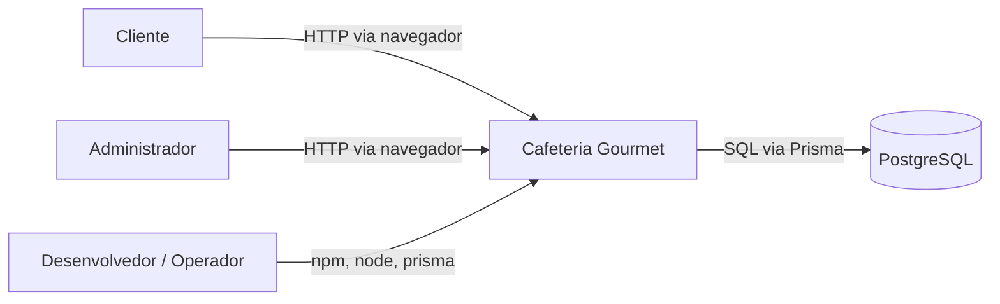
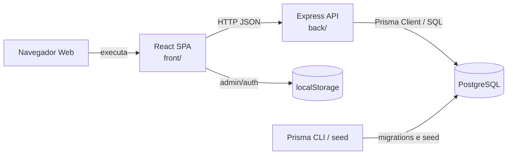
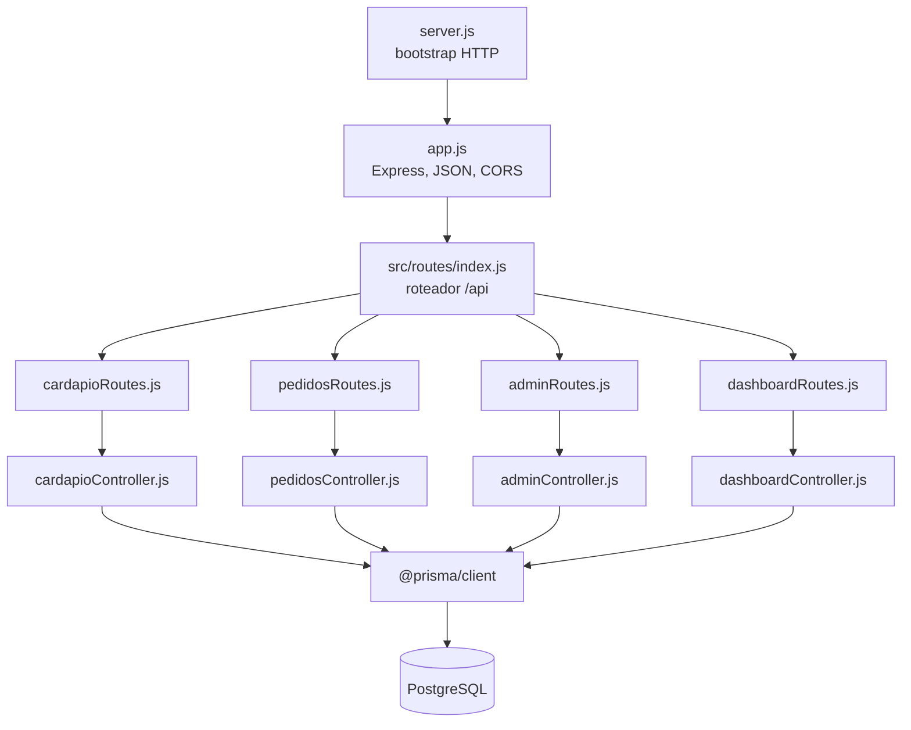
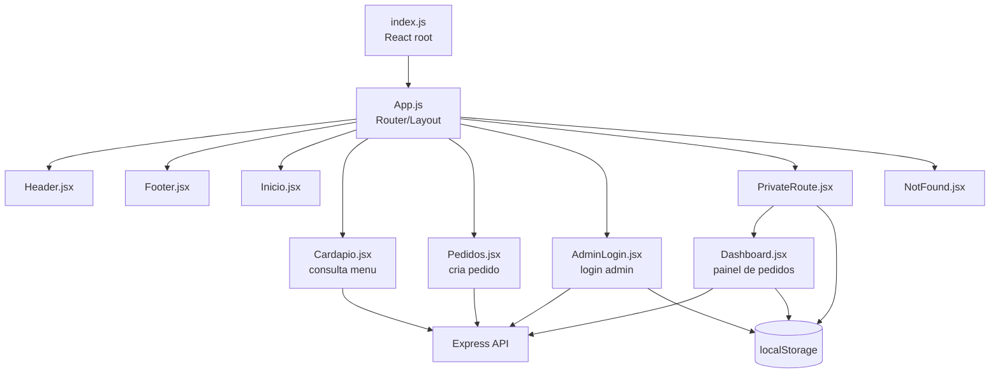
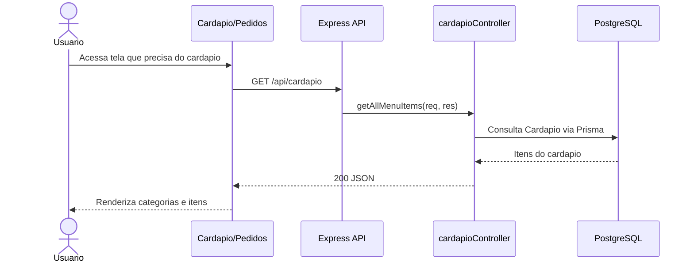
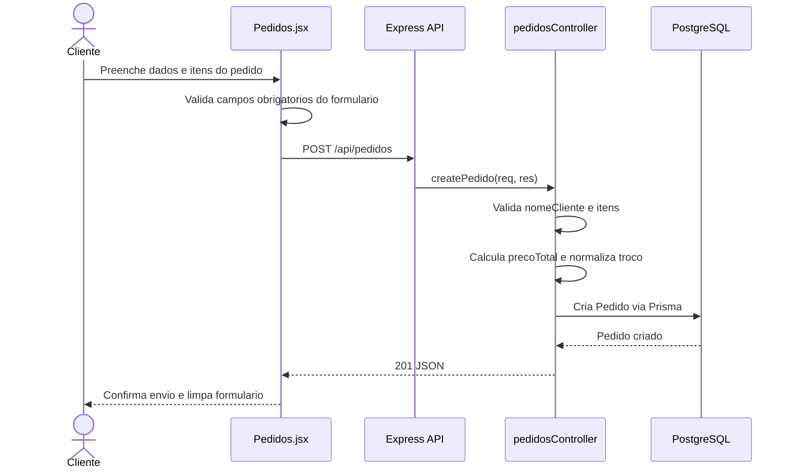
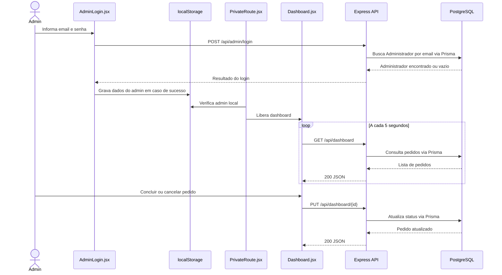

# Architectural Design Document - Cafeteria Gourmet

**Projeto:** Estudos Especiais - Cafe Gourmet  
**Tipo:** Architectural Design Document / Software Architecture Document  
**Data:** 2026-05-31  
**Escopo C4:** nivel 1 (System Context), nivel 2 (Containers) e nivel 3 (Components)

## 1. Introducao

### Escopo e proposito

Este documento descreve a arquitetura da aplicacao web Cafeteria Gourmet, um sistema full stack para exibicao de cardapio, criacao de pedidos e acompanhamento administrativo de pedidos de uma cafeteria.

O ADD cobre:

- contexto do sistema;
- containers executaveis e infraestrutura de dados;
- componentes internos dos containers principais;
- fluxos runtime principais;
- decisoes arquiteturais;
- riscos e debitos tecnicos relevantes.

### Referencias

- `README.md`: visao geral, tecnologias, execucao local e credenciais iniciais.
- `docs/Catalogo_ICs_Repositorios.md`: catalogo de itens de configuracao e repositorios.
- `docs/ConfigurationItens.md`: itens de configuracao versionados.
- `itens_configuracao.md`: lista complementar de itens de configuracao.

Nao ha SRS ou SDD formal registrado no repositorio.

## 2. Contexto do Sistema

### O que o sistema faz

O Cafeteria Gourmet permite que clientes consultem o cardapio, montem pedidos para retirada ou entrega e enviem esses pedidos para persistencia. Administradores acessam um painel para acompanhar pedidos e atualizar seu status operacional.

### Quem usa

| Ator | Uso principal |
|---|---|
| Cliente | Acessa a interface web, visualiza o cardapio e cria pedidos |
| Administrador | Acessa o painel administrativo, consulta pedidos e atualiza status |
| Desenvolvedor / operador | Configura ambiente, executa migrations, seed, backend e frontend |

### Sistemas externos

| Sistema externo | Relacao com o Cafeteria Gourmet |
|---|---|
| PostgreSQL | Armazena cardapio, pedidos e administradores |
| Navegador web | Executa a SPA React e armazena estado local de sessao administrativa |
| Runtime Node.js | Executa a API Express e os scripts Prisma |

### C4 nivel 1 - System Context

## 3. Containers

### C4 nivel 2 - Container diagram

### Containers e comunicacao

| Container | Processo / artefato | Responsabilidade | Comunicacao |
|---|---|---|---|
| React SPA | `front/src/index.js`, `front/src/App.js` | Interface publica e administrativa | Renderizacao no navegador; chamadas HTTP JSON para a API; leitura/escrita em `localStorage` |
| Express API | `back/server.js`, `back/app.js` | Expor endpoints REST, aplicar middlewares HTTP e coordenar acesso aos dados | HTTP JSON sob `/api`; CORS habilitado; Prisma Client para persistencia |
| PostgreSQL | Configurado por `DATABASE_URL` | Persistir `Cardapio`, `Pedido` e `Administrador` | SQL emitido pelo Prisma Client |
| Prisma CLI / seed | `back/prisma/schema.prisma`, `back/prisma/seed.js`, migrations | Manutencao do schema e criacao dos dados iniciais | Conexao PostgreSQL via `DATABASE_URL` |

### Protocolos e dados trafegados

| Origem | Destino | Protocolo | Dados principais |
|---|---|---|---|
| React SPA | Express API | HTTP JSON | Itens de cardapio, pedidos, credenciais administrativas, atualizacao de status |
| Express API | PostgreSQL | Prisma Client / SQL | Registros de `Cardapio`, `Pedido` e `Administrador` |
| React SPA | `localStorage` | Web Storage API | Dados basicos de administrador autenticado no cliente |

## 4. Componentes

### Backend - C4 nivel 3

| Componente | Responsabilidade | Interface |
|---|---|---|
| `server.js` | Iniciar o processo HTTP na porta configurada | `PORT` ou porta padrao `4000` |
| `app.js` | Criar o app Express, habilitar JSON/CORS e montar o roteador raiz | Middlewares Express e prefixo `/api` |
| `src/routes/index.js` | Agregar as rotas de recursos da API | `router.use('/cardapio')`, `router.use('/pedidos')`, `router.use('/admin')`, `router.use('/dashboard')` |
| Rotas de recurso | Mapear metodos e caminhos HTTP para handlers | Express Router |
| Controllers | Processar requisicoes, aplicar validacoes basicas, chamar Prisma e montar respostas HTTP | `req`, `res`, Prisma Client |
| Prisma schema | Definir os modelos persistidos | `Cardapio`, `Pedido`, `Administrador` |

### Frontend - C4 nivel 3

| Componente | Responsabilidade | Interface |
|---|---|---|
| `index.js` | Montar a SPA no DOM | `ReactDOM.createRoot`, elemento `#root` |
| `App.js` | Definir rotas cliente e layout global | React Router |
| `Header.jsx` / `Footer.jsx` | Navegacao e rodape das rotas publicas | Links internos e renderizacao React |
| `Cardapio.jsx` | Buscar itens de cardapio, agrupar por categoria e renderizar abas | `GET /api/cardapio` |
| `Pedidos.jsx` | Montar pedido, validar formulario e enviar pedido | `GET /api/cardapio`, `POST /api/pedidos` |
| `AdminLogin.jsx` | Enviar credenciais administrativas e gravar dados locais de login | `POST /api/admin/login`, `localStorage` |
| `PrivateRoute.jsx` | Controlar acesso client-side ao dashboard | `localStorage.admin` |
| `Dashboard.jsx` | Consultar pedidos periodicamente e atualizar status | `GET /api/dashboard`, `PUT /api/dashboard/{id}` |

### Modelo de dados

| Modelo | Campos principais | Uso |
|---|---|---|
| `Cardapio` | `id`, `nome`, `preco`, `categoria`, `criadoEm` | Itens exibidos no cardapio e utilizados na montagem de pedidos |
| `Pedido` | `id`, `nomeCliente`, `itens`, `precoTotal`, dados de pagamento, dados de entrega, dados de troco, `status`, `criadoEm` | Pedido criado pelo cliente e acompanhado no dashboard administrativo |
| `Administrador` | `id`, `email`, `senha`, `criadoEm` | Credenciais administrativas |

## 5. Fluxos Runtime Principais

### Consultar cardapio

### Criar pedido

### Login administrativo e dashboard

## 6. Decisoes Arquiteturais

### ADR-001 - Separar frontend SPA e backend REST

**Contexto:** o sistema precisa oferecer uma interface web para clientes e administradores, e tambem precisa persistir dados em banco relacional.

**Decisao:** separar a aplicacao em uma SPA React (`front/`) e uma API Express (`back/`), comunicando-se por HTTP JSON.

**Consequencias:** a separacao reduz acoplamento entre interface e backend, permite executar frontend e backend como processos distintos e facilita evolucao independente das telas e dos endpoints. Em contrapartida, exige configuracao correta de URL/proxy e disciplina para manter os contratos HTTP estaveis.

### ADR-002 - Usar Express como camada HTTP da API

**Contexto:** a API possui recursos simples e bem delimitados: cardapio, pedidos, login administrativo e dashboard.

**Decisao:** implementar a camada HTTP com Express, usando JSON como formato de entrada/saida e agrupando endpoints sob o prefixo `/api`.

**Consequencias:** Express oferece baixo custo de implementacao e e adequado para uma API REST pequena. O prefixo `/api` separa claramente chamadas de backend das rotas da SPA. Como a API nao possui versionamento de caminho, mudancas futuras de contrato exigirao cuidado adicional.

### ADR-003 - Organizar o backend em rotas e controllers

**Contexto:** cada recurso HTTP precisa mapear metodos e caminhos para uma logica de atendimento.

**Decisao:** manter arquivos de rota para declaracao HTTP e arquivos de controller para tratamento das requisicoes.

**Consequencias:** a estrutura e simples de entender e suficiente para o tamanho atual do sistema. A medida que regras de negocio crescerem, pode ser necessario introduzir uma camada de servicos para evitar controllers muito carregados.

### ADR-004 - Usar Prisma com PostgreSQL

**Contexto:** o sistema precisa de persistencia relacional para itens de cardapio, pedidos e administradores, alem de migrations versionadas.

**Decisao:** usar PostgreSQL como banco de dados e Prisma como camada de acesso a dados e definicao de schema.

**Consequencias:** o schema fica declarativo em `schema.prisma`, as migrations ficam versionadas e o acesso aos dados permanece padronizado pelo Prisma Client. A dependencia direta de controllers em Prisma aumenta o acoplamento da API com a persistencia.

### ADR-005 - Usar React Router para navegacao da SPA

**Contexto:** a interface possui telas publicas e uma area administrativa.

**Decisao:** usar React Router para definir rotas client-side (`/`, `/cardapio`, `/pedidos`, `/admin/login`, `/admin/dashboard`) e controlar o layout por rota.

**Consequencias:** a navegacao entre telas ocorre sem recarregar a aplicacao e o dashboard pode ter layout proprio sem header/footer. A protecao de rota no cliente melhora a experiencia de navegacao, mas nao substitui autorizacao no backend.

### ADR-006 - Atualizar o dashboard por polling

**Contexto:** o painel administrativo precisa refletir mudancas em pedidos sem exigir atualizacao manual constante.

**Decisao:** consultar periodicamente `GET /api/dashboard` a cada 5 segundos.

**Consequencias:** o polling evita infraestrutura adicional como WebSocket ou Server-Sent Events e funciona com a API REST existente. A abordagem introduz atraso de ate 5 segundos e pode gerar chamadas redundantes se houver muitos dashboards abertos.

### ADR-007 - Armazenar itens do pedido como JSON

**Contexto:** um pedido contem uma lista de itens com nome, categoria, preco e quantidade no momento da compra.

**Decisao:** persistir a lista de itens no campo JSON `Pedido.itens`.

**Consequencias:** o pedido preserva um snapshot dos itens comprados sem depender de joins ou de historico de preco no cardapio. A decisao reduz complexidade inicial, mas dificulta consultas relacionais sobre itens vendidos, ranking de produtos e relatorios por categoria.

## 7. Riscos e Debitos Tecnicos

### Ciclos de dependencia

Nao foram encontrados ciclos diretos entre modulos de codigo. O grafo principal segue a direcao: bootstrap -> app Express -> rotas -> controllers -> Prisma.

### Acoplamentos problematicos

| Risco/debito | Impacto |
|---|---|
| Controllers instanciam `PrismaClient` diretamente | Aumenta acoplamento com persistencia, dificulta testes unitarios e pode multiplicar conexoes |
| `back/prismaClient.js` nao e utilizado | Indica uma tentativa de centralizacao de acesso a dados que nao foi consolidada |
| URLs da API aparecem hard-coded no frontend | Dificulta troca de ambiente e deploy fora do localhost |
| Categorias do cardapio estao fixas no frontend | Novas categorias no banco podem nao aparecer sem alteracao de codigo |
| Uso misto de `axios` e `fetch` | Deixa tratamento de erro, base URL e convencoes de chamada inconsistentes |

### Seguranca e controle de acesso

| Risco/debito | Impacto |
|---|---|
| Endpoints administrativos nao exigem autenticacao no backend | A area administrativa depende de controle client-side e fica vulneravel a chamadas diretas |
| Senhas sao comparadas em texto claro | Risco critico de seguranca; senhas deveriam ser armazenadas com hash apropriado |
| Logs de login incluem dados sensiveis | Pode expor credenciais em console ou logs operacionais |
| Logout remove `auth`, mas a rota protegida verifica `admin` | O estado local pode permanecer inconsistente apos logout |

### Inconsistencias funcionais

| Inconsistencia | Impacto |
|---|---|
| Dashboard usa `localhost:3000/api`, enquanto outras telas usam `localhost:4000/api` | O dashboard depende do proxy de desenvolvimento para funcionar |
| `Pedidos.jsx` envia itens com `nome`/`quantidade`, mas `Dashboard.jsx` renderiza `name`/`quantity` | Itens podem aparecer vazios ou incompletos no painel |
| `dashboardController.createPedido` tenta usar `numeroMesa`, campo ausente no schema atual | Funcao exportada esta desalinhada com o modelo e falharia se fosse roteada |
| `pedidosController.deletePedido` nao possui rota correspondente | Funcionalidade existe no controller, mas nao esta exposta pela API |

### Cobertura de testes

- Backend nao possui testes automatizados declarados; o script de teste atual retorna erro.
- Controllers, rotas, validacoes, Prisma/migrations e fluxos de erro nao possuem cobertura automatizada.
- O teste frontend existente e o teste inicial do Create React App e nao valida as telas atuais.
- Nao ha testes de integracao ou end-to-end para os fluxos de cardapio, pedido, login e dashboard.
